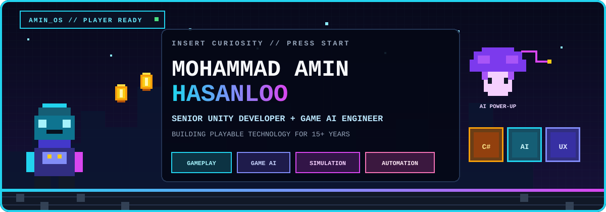
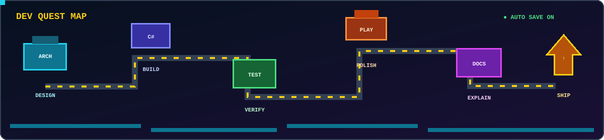
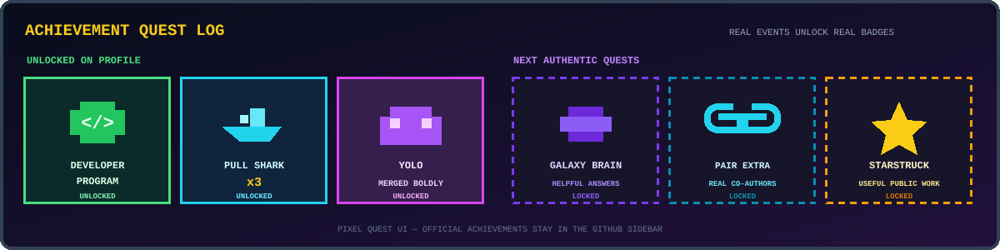

<div align="center">



<h3>Senior Unity Game Developer · Gameplay &amp; Systems Engineer</h3>

<p>2D · 3D · Mobile · VR/AR · Game AI · Simulation · Production Tooling</p>

<a href="https://www.linkedin.com/in/aminhasanloo/"></a>
<a href="mailto:hsoamin76@gmail.com"></a>
<a href="https://github.com/AminHasanloo?tab=repositories"></a>

</div>

## `PLAYER SELECT // AMIN HASANLOO`

I build the systems behind playable products: **gameplay architecture, game AI, simulation, mobile integrations, performance and production tooling**.

My main stack is **Unity + C#**. I work across 2D and 3D games, Android publishing, VR/AR experiences and serious-game systems. Around the engine, I build automation and AI-assisted tools while keeping runtime behavior deterministic, testable and production-safe.

```text
MISSION   Turn game ideas into maintainable playable systems
METHOD    Modular architecture + measurable behavior + focused iteration
OUTPUT    Unity systems that teams can understand, test, extend and ship
```

Open to **remote Unity engineering, gameplay systems, game AI, simulation and XR opportunities**.

## `LEVEL SELECT // FEATURED ENGINEERING WORK`

### 🚗 [Unity AI Vehicle System](https://github.com/AminHasanloo/Unity-AI-Vehicle-System)

3D vehicle AI prototype covering path following, obstacle avoidance, overtaking, reversing, stuck recovery and wheel-based movement. Includes screenshots and a gameplay video.

`Unity` `C#` `Vehicle AI` `Pathfinding` `Physics`

### 💳 [Unity Monetization Framework](https://github.com/AminHasanloo/UnityMonetizationFramework)

An adapter-oriented Unity layer for IAP and ads across Google Play, Café Bazaar, Myket, AdMob, Tapsell and LevelPlay. The next public milestone focuses on English documentation, provider isolation and integration tests.

`Unity` `C#` `IAP` `Ads` `Android` `SDK Integration`

### 📊 [Unity Analytics Lite](https://github.com/AminHasanloo/Unity-Analytics-Lite)

A lightweight event pipeline with batching, a JSONL offline queue, sessions, consent controls and configurable backend collection.

`Unity` `C#` `Analytics` `Offline Queue` `Privacy`

### 📦 [Unity Package Exporter](https://github.com/AminHasanloo/UnityExportPackageComplete)

A focused Unity Editor utility for exporting selected project folders with dependency and versioning options. Planned work converts it into a clean UPM package with safer release automation.

`Unity Editor` `C#` `UPM` `Developer Tooling`

## `PLAY MODES // PRODUCTION RANGE`

- **2D games:** character systems, combat, animation state, UI, save/progression and mobile optimization
- **3D games:** vehicles, physics-driven gameplay, navigation, game AI and simulation
- **VR/AR:** interactive training flows, spatial interactions, XR UI and device-aware presentation
- **Android publishing:** Google Play, Café Bazaar and Myket release variants
- **Monetization:** Unity IAP, AdMob, Tapsell and provider-isolated integrations
- **Production engineering:** profiling, pooling, data-driven configuration, automated checks and maintainable team architecture

## `WORLD MAP // HOW I SHIP`

<div align="center">



</div>

I prefer explicit dependencies, small focused components and gameplay rules that can be tested without loading an entire scene. The animation above is decorative; the engineering path is the real point.

## `INVENTORY // CORE STACK`

<div align="center">


<br /><br />


</div>

## `R&D QUESTS // CURRENT DIRECTION`

- Deterministic game AI and reusable gameplay systems
- AI-assisted production tools without runtime unpredictability
- Mobile monetization adapters with safe testing and clear failure states
- Versioned save data, replayable simulation and automated QA evidence
- Serious games and XR training with measurable outcomes

## `ACHIEVEMENTS // SELECTED HIGHLIGHTS`

- 🥇 **1st National Place** — Resistance & Martyrs Defense Festival, Iran, 2024
- 🎮 **Game Nominee** — National Investment Event in Resistance Games, Isfahan, 2024
- 📱 **Selected Application** — Café Bazaar App Festival, 2016
- 🥇 **1st Place** — Provincial Web Design Skills Competition, Zanjan, 2016
- 🥈 **2nd Place** — Software Engineering Competition, Al-Ghadir University, 2014

<div align="center">



</div>

<details>
<summary><b>LIVE TELEMETRY // PUBLIC GITHUB</b></summary>
<br />

<div align="center">


<br />


</div>

</details>

## `SNAKE LEVEL // KEEP MOVING`

<div align="center">

<picture>
  <source media="(prefers-color-scheme: dark)" srcset="https://raw.githubusercontent.com/AminHasanloo/AminHasanloo/output/github-contribution-grid-snake-dark.svg" />
  <source media="(prefers-color-scheme: light)" srcset="https://raw.githubusercontent.com/AminHasanloo/AminHasanloo/output/github-contribution-grid-snake.svg" />
  
</picture>

### `PLAY • BUILD • SIMULATE • SHIP`

If you are building a Unity game, simulation or interactive training product, I am interested in the engineering problems behind it.

</div>

<details>
<summary><b>Profile automation status</b></summary>
<br />

<a href="https://github.com/AminHasanloo/AminHasanloo/actions/workflows/profile-visuals.yml"></a>
<a href="https://github.com/AminHasanloo/AminHasanloo/actions/workflows/profile-health.yml"></a>
<a href="https://github.com/AminHasanloo/AminHasanloo/actions/workflows/weekly-focus.yml"></a>

</details>
